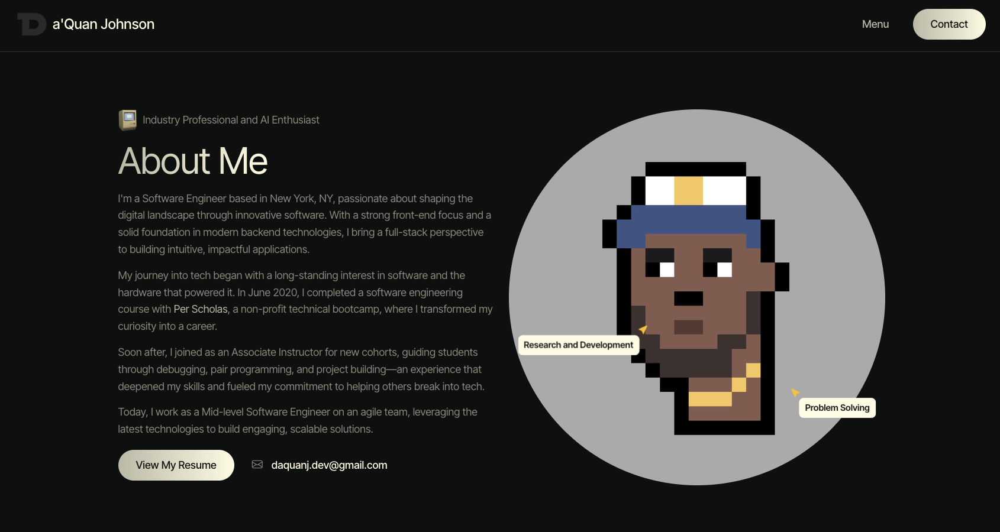

<h1 align="center"> 
 
</br> daquanjohnson
</h1>

# Application
<h4 align="center">
Built with JQuery, this fully responsive personal portfolio website serves as a central hub to showcase my projects, skills, and milestones.
<a href="https://daquanjohnson.me" target="_blank" rel="noreferrer"> 🍾 Live Site</a>
<!-- This first iteration of <a href="https://daquanjohnson.me">daquanjohnson.me</a> built with jquery and bootstrap.  -->
</h4>

 

# Repository
### This repository contains a single-page site:
- **Index.HTML**: The single-page HTML site located in the root directory
- **Assets**: All static files located in the `/assets` directory
  - `/css` - Stylesheets for custom styling
  - `/fonts` - Font files used in the project
  - `/images` - Images for the site's visuals
  - `/js` - JavaScript libraries, plugins, and custom scripts

## Technologies Used
- **Bootstrap**: For layout and responsive design
- **CSS**: Custom styling for site elements
- **jQuery**: Provides interactivity and dynamic content
- **Swiper**: For image carousels and sliders
- **Venobox**: Lightbox functionality for image and video viewing
- **Isotope & Masonry**: Used for responsive grid layouts
- **imagesLoaded**: Ensures images load before layout adjustments
- **IcoMoon Fonts & Icons**: Icon fonts for visual elements
- **AWS Lambda, SES, and API Gateway**: Python-powered  microservice for contact form email handling. **The Lambda function is managed separately in [this repository](https://github.com/DaquanJ/lambdas).*

## 🛠 set-up

### Prerequisites

Ensure you have the following installed:

- **A modern web browser** (e.g., Chrome, Firefox, Safari)

### Installation

1. **Clone the repository:**

    ```bash
    git clone https://github.com/yourusername/your-html-site.git
    cd your-html-site
    ```

### Running the Application

1. **Open Directly:** Open `index.html` in your preferred web browser.
    - You can simply double-click `index.html` to open it in your default browser, or right-click and choose "Open with" to select a specific browser.

2. **Live Server** (Optional): Open `VS Code`

    - Install the **Live Server** extension to easily view your changes in real-time.

    - To install:
      - Open **Extensions** in VS Code (left sidebar   or Ctrl+Shift+X).
      - Search for **Live Server** and click **Install**.
      - Once installed, right-click on `index.html` and select **Open with Live Server**. This will open your site in a browser window and automatically refresh when you make and save changes.